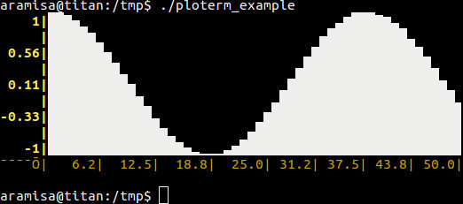

# PLOTERM

## Synopsis

Ploterm is a minimalistic plotting library for command-line
applications, with C++ and Python bindings.

The library is very new, so expect many changes.

## Code Example

## Motivation

## Installation

## API Reference

## Tests

## Contributors

## License